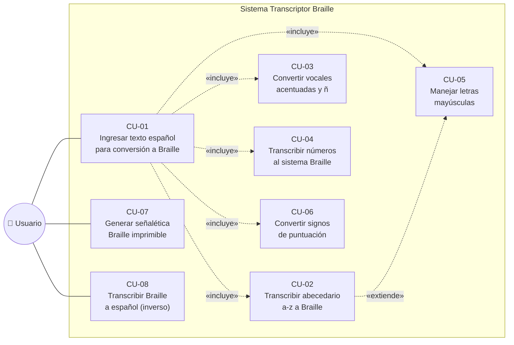

# Diagrama de Casos de Uso

## Spanish Braille Application

**Fase XP:** II. Diseño  
**Rol:** Programador — Diseño (Elian Caizapanta)  
**Basado en:** Historias de Usuario V2 (01H1–07H7) y código existente (ITERACION-2)  

---

### Historias de Usuario V2 — Referencia

| ID | Historia de Usuario | Estimación | Sprint |
|----|---------------------|-----------|--------|
| 01H1 | Transcribir abecedario (a–z) a Braille | 5 pts | 1 |
| 02H2 | Convertir vocales acentuadas y ñ a Braille | 3 pts | 1 |
| 03H3 | Transcribir números (0–9) con signo de número Braille | 2 pts | 1 |
| 04H4 | Manejar letras mayúsculas con indicador Braille | 2 pts | 1 |
| 05H5 | Convertir signos de puntuación básicos a Braille | 3 pts | 2 |
| 06H6 | Generar señalética Braille imprimible | 7 pts | 2 |
| 07H7 | Transcribir patrón Braille a español (bidireccional) | 5 pts | 2 |

> Sprint 1 = 12 pts · Sprint 2 = 15 pts · Total Release = 27 pts

---

### Diagrama General

---

### SPRINT 1

---

#### CU-01 — Ingresar texto en español para conversión a Braille

| Campo | Descripción |
|-------|-------------|
| **ID** | CU-01 |
| **HU V2** | 01H1 — Transcribir abecedario (a–z) a Braille |
| **Actor(es)** | Usuario |
| **Descripción** | El usuario escribe o pega un texto en español en el campo de entrada de la aplicación web y solicita su conversión al sistema Braille. |
| **Precondiciones** | La aplicación web está desplegada y accesible. El usuario tiene acceso a un navegador web. |
| **Flujo Principal** | 1. El usuario accede a la interfaz principal de la aplicación. 2. El sistema muestra el campo de entrada de texto y el botón "Convertir". 3. El usuario escribe o pega un texto en español en el campo de entrada. 4. El usuario hace clic en el botón "Convertir". 5. El sistema valida que el campo de entrada no esté vacío. 6. El sistema procesa el texto y genera la representación Braille. 7. El sistema muestra el resultado Braille en el área de salida. |
| **Flujos Alternativos** | A-01: Si el texto contiene caracteres no soportados, el sistema los omite e informa al usuario con un mensaje de advertencia. |
| **Postcondiciones** | El texto en español ha sido convertido y su equivalente Braille se muestra en la interfaz. |
| **Excepciones** | E-01: El campo de entrada está vacío: el sistema muestra el mensaje "Por favor ingresa un texto para convertir". |
| **Código** | `TranscriptionController.java` → endpoint `POST /transcribir-Español` |

---

#### CU-02 — Transcribir abecedario español (a–z) a Braille

| Campo | Descripción |
|-------|-------------|
| **ID** | CU-02 |
| **HU V2** | 01H1 — Transcribir abecedario (a–z) a Braille |
| **Actor(es)** | Usuario / Sistema |
| **Descripción** | El sistema convierte internamente cada letra del abecedario español (a–z, incluyendo las tres series Braille) al cuadratín Braille correspondiente. |
| **Precondiciones** | El texto de entrada ha sido recibido por el sistema tras el CU-01. |
| **Flujo Principal** | 1. El sistema itera carácter a carácter sobre el texto recibido. 2. Para cada letra, el sistema consulta el mapa de caracteres (series 1, 2 y 3 del Braille español). 3. El sistema obtiene el patrón de puntos Braille correspondiente a la letra. 4. El sistema agrega el cuadratín resultante a la cadena de salida. 5. Al finalizar, retorna la cadena Braille completa para su visualización. |
| **Flujos Alternativos** | A-01: Si la letra es mayúscula, el sistema delega el manejo al CU-05 antes de continuar con la conversión. |
| **Postcondiciones** | Cada letra del texto ha sido mapeada a su cuadratín Braille correcto. |
| **Excepciones** | E-01: Letra no encontrada en el mapa: el sistema registra una advertencia y omite el carácter. |
| **Código** | `BrailleDictionary.java` → `initLetters()` · `BrailleMapper.java` → `españolABraille()` |

---

#### CU-03 — Convertir vocales acentuadas y ñ a Braille

| Campo | Descripción |
|-------|-------------|
| **ID** | CU-03 |
| **HU V2** | 02H2 — Convertir vocales acentuadas y ñ a Braille |
| **Actor(es)** | Usuario / Sistema |
| **Descripción** | El sistema convierte las vocales con tilde (á, é, í, ó, ú) y la ñ al cuadratín Braille definido en la tabla de letras adicionales. |
| **Precondiciones** | El texto contiene al menos una vocal acentuada o el carácter ñ. |
| **Flujo Principal** | 1. El sistema detecta un carácter del conjunto {á, é, í, ó, ú, ñ, ü}. 2. El sistema consulta la tabla de letras adicionales del cuadro de resumen Braille español. 3. El sistema obtiene el patrón de puntos correspondiente. 4. El sistema inserta el cuadratín en la posición correcta de la cadena de salida. |
| **Flujos Alternativos** | A-01: Si el carácter es "ü", el sistema lo convierte usando el patrón 1256 según la tabla de letras adicionales. |
| **Postcondiciones** | Todos los caracteres especiales del español están representados correctamente en la salida Braille. |
| **Excepciones** | E-01: Carácter acentuado sin mapeo definido: el sistema lo omite y registra la advertencia en el log. |
| **Código** | `BrailleDictionary.java` → `initAccents()` |

---

#### CU-04 — Transcribir números al sistema Braille

| Campo | Descripción |
|-------|-------------|
| **ID** | CU-04 |
| **HU V2** | 03H3 — Transcribir números (0–9) con signo de número Braille |
| **Actor(es)** | Usuario / Sistema |
| **Descripción** | El sistema detecta secuencias numéricas en el texto, antepone el signo de número Braille (puntos 3456) una sola vez y convierte cada dígito usando la primera serie del Braille español. |
| **Precondiciones** | El texto de entrada contiene al menos un dígito (0–9). |
| **Flujo Principal** | 1. El sistema detecta que el carácter actual es un dígito. 2. Si no se ha activado el modo numérico, el sistema inserta el signo de número Braille (puntos 3456). 3. El sistema convierte el dígito usando la equivalencia de la primera serie Braille (1→a, 2→b, ..., 0→j). 4. El sistema continúa en modo numérico hasta encontrar un carácter no numérico. 5. Al encontrar un carácter no numérico, desactiva el modo numérico. |
| **Flujos Alternativos** | A-01: Secuencia multi-cifra (ej. "123"): el signo de número se inserta solo una vez al inicio de la secuencia. |
| **Postcondiciones** | Cada número del texto está precedido por el signo de número Braille y mapeado correctamente. |
| **Excepciones** | E-01: El número contiene caracteres inválidos: el sistema trunca la secuencia en el primer carácter inválido. |
| **Código** | `BrailleDictionary.java` → `initNumbers()` · `SIGNO_NUMERO = mask(3,4,5,6)` |

---

#### CU-05 — Manejar letras mayúsculas con indicador Braille

| Campo | Descripción |
|-------|-------------|
| **ID** | CU-05 |
| **HU V2** | 04H4 — Manejar letras mayúsculas con indicador Braille (puntos 46) |
| **Actor(es)** | Sistema |
| **Descripción** | El sistema detecta letras mayúsculas en el texto de entrada y antepone el cuadratín indicador de mayúscula (puntos 46) antes de la letra correspondiente. |
| **Precondiciones** | El texto de entrada contiene al menos una letra mayúscula. |
| **Flujo Principal** | 1. El sistema detecta que el carácter actual es una letra mayúscula. 2. El sistema inserta el cuadratín indicador de mayúscula (puntos 46) en la cadena de salida. 3. El sistema convierte la letra a su equivalente minúscula para consultar el mapa Braille. 4. El sistema inserta el cuadratín de la letra correspondiente. 5. El sistema continúa con el siguiente carácter. |
| **Flujos Alternativos** | A-01: Palabra completa en mayúsculas: el sistema inserta doble indicador de mayúscula (puntos 46 + 46) antes de la palabra. |
| **Postcondiciones** | Cada letra mayúscula en el texto está precedida por el indicador de mayúscula Braille en la salida. |
| **Excepciones** | E-01: Carácter mayúsculo sin equivalente minúsculo en el mapa: el sistema lo omite y registra la advertencia. |
| **Código** | `BrailleMapper.java` → `SIGNO_MAYUSCULA = mask(4,6)` · lógica en `españolABraille()` |

---

### SPRINT 2

---

#### CU-06 — Convertir signos de puntuación a Braille

| Campo | Descripción |
|-------|-------------|
| **ID** | CU-06 |
| **HU V2** | 05H5 — Convertir signos de puntuación básicos a Braille |
| **Actor(es)** | Usuario / Sistema |
| **Descripción** | El sistema convierte los signos de puntuación básicos del español (punto, coma, punto y coma, signos de interrogación y exclamación de apertura y cierre) al cuadratín Braille correspondiente. |
| **Precondiciones** | El texto de entrada contiene al menos un signo de puntuación soportado. |
| **Flujo Principal** | 1. El sistema detecta un signo de puntuación en el texto. 2. El sistema consulta la sección de signos del cuadro de resumen Braille español. 3. El sistema obtiene el patrón de puntos del signo. 4. El sistema inserta el cuadratín en la posición correcta de la cadena de salida. |
| **Flujos Alternativos** | A-01: Signo no soportado (ej. @, #): el sistema lo omite e indica al usuario con un mensaje de advertencia. |
| **Postcondiciones** | Todos los signos de puntuación soportados están representados en la salida Braille. |
| **Excepciones** | E-01: Signo sin mapeo en la tabla: el sistema lo omite y continúa con el siguiente carácter. |
| **Código** | `BrailleDictionary.java` → `initPunctuation()` |

---

#### CU-07 — Generar señalética Braille imprimible

| Campo | Descripción |
|-------|-------------|
| **ID** | CU-07 |
| **HU V2** | 06H6 — Generar señalética Braille imprimible (exportable PNG/PDF) |
| **Actor(es)** | Usuario |
| **Descripción** | El usuario ingresa el texto de una señal (ej. "Salida de emergencia") y el sistema genera una plantilla de señalética con el texto en tinta y su equivalente Braille, lista para imprimir o exportar. |
| **Precondiciones** | El sistema puede convertir texto a Braille (CU-01 al CU-06 funcionales). El usuario ha ingresado el texto de la señal. |
| **Flujo Principal** | 1. El usuario escribe el texto de la señal en el campo correspondiente. 2. El usuario hace clic en "Generar Señalética". 3. El sistema convierte el texto a Braille usando el motor de conversión. 4. El sistema aplica la plantilla de señalética: texto en tinta en la parte superior y cuadratines Braille en la inferior. 5. El sistema renderiza la vista previa de la señalética en la interfaz. 6. El usuario hace clic en "Exportar" para descargar la señalética. 7. El sistema genera el archivo (PNG o PDF) y lo descarga en el navegador del usuario. |
| **Flujos Alternativos** | A-01: El usuario elige formato PNG: el sistema genera una imagen de alta resolución (300 dpi). A-02: El usuario elige formato PDF: el sistema genera un PDF de una página con dimensiones de señalética estándar. |
| **Postcondiciones** | El usuario dispone de un archivo de señalética listo para imprimir con texto en tinta y Braille. |
| **Excepciones** | E-01: Error al generar el archivo de exportación: el sistema muestra "No se pudo generar el archivo. Intente de nuevo". E-02: El texto de la señal supera el largo máximo permitido: el sistema alerta al usuario y limita la entrada. |
| **Código** | *Pendiente de implementación — Sprint 2* |

---

#### CU-08 — Transcribir patrón Braille a carácter español (inverso)

| Campo | Descripción |
|-------|-------------|
| **ID** | CU-08 |
| **HU V2** | 07H7 — Transcribir patrón Braille a español (bidireccional) |
| **Actor(es)** | Usuario |
| **Descripción** | El usuario selecciona o ingresa un patrón de puntos Braille (indicando cuáles de los 6 puntos están activos) y el sistema devuelve el carácter español correspondiente. |
| **Precondiciones** | El mapa de caracteres Braille ↔ español está disponible en el sistema. |
| **Flujo Principal** | 1. El usuario accede a la sección de conversión inversa en la interfaz. 2. El usuario ingresa texto en Braille Unicode. 3. El usuario hace clic en "Convertir". 4. El sistema construye la máscara de bits de cada carácter Braille. 5. El sistema busca la máscara en el mapa inverso Braille → español. 6. El sistema muestra el texto español correspondiente. |
| **Flujos Alternativos** | A-01: El usuario ingresa el patrón como texto numérico (ej. "1-2-5"): el sistema lo interpreta y busca el carácter correspondiente. |
| **Postcondiciones** | El usuario conoce el texto en español que corresponde al patrón Braille ingresado. |
| **Excepciones** | E-01: El patrón no corresponde a ningún carácter definido: el sistema muestra "Patrón no reconocido en el Braille español". |
| **Código** | `BrailleMapper.java` → `brailleAEspañol()` · `EspañolMapper.java` |

---

### Matriz de Trazabilidad HU V2 ↔ Casos de Uso ↔ Código

| HU V2 | Descripción | Caso(s) de Uso | Sprint | Código (ITERACION-2) |
|--------|-------------|----------------|--------|---------------------|
| 01H1 | Transcribir abecedario (a–z) | CU-01, CU-02 | 1 | `BrailleDictionary.initLetters()`, `BrailleMapper.españolABraille()` |
| 02H2 | Vocales acentuadas y ñ | CU-03 | 1 | `BrailleDictionary.initAccents()` |
| 03H3 | Números con signo numérico | CU-04 | 1 | `BrailleDictionary.initNumbers()`, `SIGNO_NUMERO` |
| 04H4 | Mayúsculas con indicador | CU-05 | 1 | `BrailleMapper.SIGNO_MAYUSCULA` |
| 05H5 | Signos de puntuación | CU-06 | 2 | `BrailleDictionary.initPunctuation()` |
| 06H6 | Señalética imprimible | CU-07 | 2 | *Pendiente — Sprint 2* |
| 07H7 | Braille → español (inverso) | CU-08 | 2 | `BrailleMapper.brailleAEspañol()`, `EspañolMapper` |
