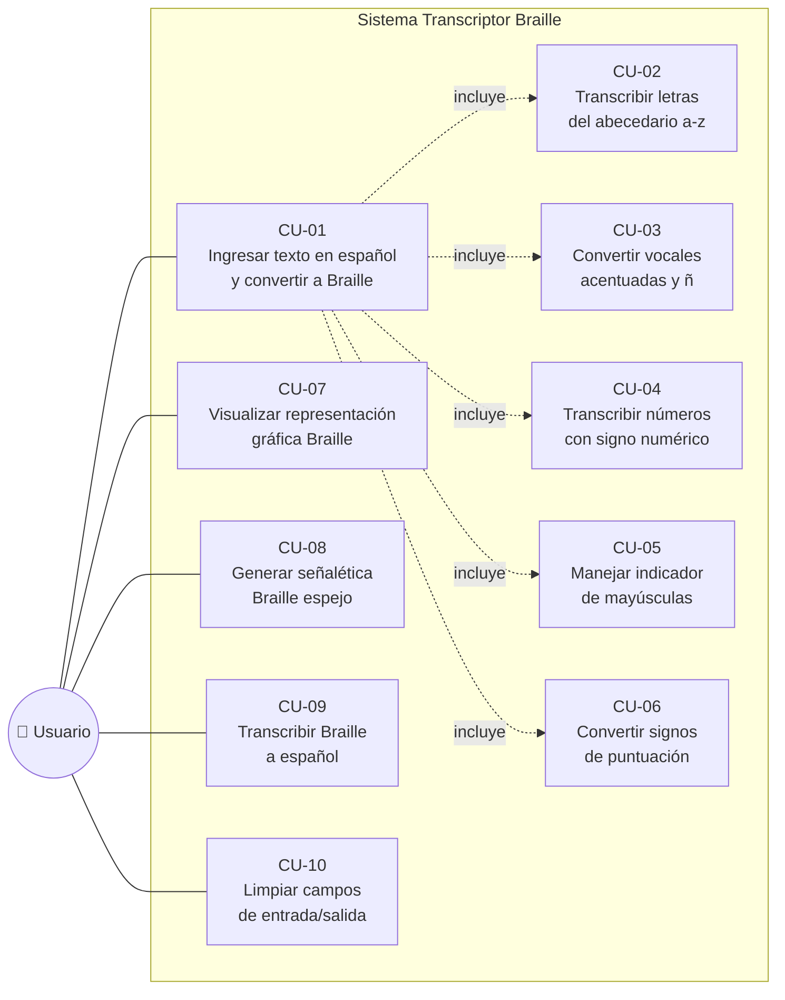

# Diagrama de Casos de Uso

## Transcriptor Braille Español

**Proyecto:** Spanish Braille Application  
**Rol:** Diseño (Elian Caizapanta)  
**Iteración:** 2  

---

### Diagrama General

---

### Descripción Detallada de Casos de Uso

#### CU-01: Ingresar texto en español y convertir a Braille

| Campo | Descripción |
|-------|-------------|
| **ID** | CU-01 |
| **HU Relacionada** | 01H1 |
| **Actor** | Usuario |
| **Precondición** | El usuario accede a la página principal del transcriptor |
| **Descripción** | El usuario ingresa texto en español (letras, números, acentos, signos) y el sistema lo convierte a su representación Braille Unicode |
| **Flujo Principal** | 1. El usuario accede a la interfaz web 2. Ingresa texto en el campo de entrada 3. Presiona el botón "Transcribir" 4. El sistema normaliza los espacios del texto 5. El sistema procesa cada carácter según su tipo 6. Se muestra el resultado en Braille Unicode |
| **Postcondición** | Se muestra la transcripción Braille en pantalla |
| **Prioridad** | Alta |

#### CU-02: Transcribir letras del abecedario (a-z)

| Campo | Descripción |
|-------|-------------|
| **ID** | CU-02 |
| **HU Relacionada** | 02H2 |
| **Actor** | Sistema (incluido en CU-01) |
| **Precondición** | Se recibe un carácter alfabético en minúscula |
| **Descripción** | El sistema busca la letra en el diccionario de mapeo Braille y retorna su máscara de puntos correspondiente convertida a Unicode |
| **Flujo Principal** | 1. Se recibe la letra 2. Se busca en el mapa de correspondencias 3. Se convierte la máscara de bits a carácter Unicode (U+2800 + máscara) 4. Se retorna el carácter Braille |
| **Postcondición** | La letra tiene su equivalente Braille |
| **Prioridad** | Alta |

#### CU-03: Convertir vocales acentuadas y ñ

| Campo | Descripción |
|-------|-------------|
| **ID** | CU-03 |
| **HU Relacionada** | 03H3 |
| **Actor** | Sistema (incluido en CU-01) |
| **Precondición** | Se recibe un carácter con tilde o la letra ñ |
| **Descripción** | El sistema mapea las vocales acentuadas (á, é, í, ó, ú) y caracteres especiales (ñ, ü) a sus representaciones Braille específicas del español |
| **Flujo Principal** | 1. Se detecta vocal acentuada o ñ/ü 2. Se busca en el mapa de acentos 3. Se retorna el patrón Braille específico |
| **Postcondición** | El carácter especial tiene su equivalente Braille correcto |
| **Prioridad** | Alta |

#### CU-04: Transcribir números con signo numérico

| Campo | Descripción |
|-------|-------------|
| **ID** | CU-04 |
| **HU Relacionada** | 04H4 |
| **Actor** | Sistema (incluido en CU-01) |
| **Precondición** | Se detecta una secuencia numérica en el texto |
| **Descripción** | El sistema antepone el signo de número Braille (puntos 3,4,5,6) antes de la primera cifra de cada secuencia numérica y reutiliza las posiciones de las letras a-j para representar 1-0 |
| **Flujo Principal** | 1. Se detecta que la palabra contiene dígitos 2. Se antepone el signo de número (⠼) 3. Cada dígito se mapea a la letra correspondiente (1→a, 2→b, ... 0→j) 4. Al encontrar un carácter no numérico se finaliza el modo número |
| **Postcondición** | La secuencia numérica se representa correctamente en Braille |
| **Prioridad** | Media |

#### CU-05: Manejar indicador de mayúsculas

| Campo | Descripción |
|-------|-------------|
| **ID** | CU-05 |
| **HU Relacionada** | 05H5 |
| **Actor** | Sistema (incluido en CU-01) |
| **Precondición** | Se detecta una letra mayúscula o una palabra completa en mayúsculas |
| **Descripción** | El sistema antepone el indicador de mayúscula Braille (puntos 4,6). Para palabras completas en mayúsculas, se duplica el indicador al inicio de la palabra |
| **Flujo Principal** | 1. Se verifica si la palabra completa está en mayúsculas 2a. Si es palabra completa: se anteponen dos signos de mayúscula (⠠⠠) 2b. Si es letra individual: se antepone un signo de mayúscula (⠠) 3. La letra se convierte a minúscula para buscar su mapeo |
| **Postcondición** | Las mayúsculas se representan correctamente en Braille |
| **Prioridad** | Media |

#### CU-06: Convertir signos de puntuación

| Campo | Descripción |
|-------|-------------|
| **ID** | CU-06 |
| **HU Relacionada** | 06H6 |
| **Actor** | Sistema (incluido en CU-01) |
| **Precondición** | Se recibe un signo de puntuación |
| **Descripción** | El sistema convierte signos de puntuación básicos (. , ; : ? ! - ( ) + * =) a sus equivalentes Braille |
| **Flujo Principal** | 1. Se detecta signo de puntuación 2. Se busca en el mapa de puntuación 3. Se retorna la máscara Braille correspondiente |
| **Postcondición** | El signo de puntuación tiene su equivalente Braille |
| **Prioridad** | Media |

#### CU-07: Visualizar representación gráfica Braille

| Campo | Descripción |
|-------|-------------|
| **ID** | CU-07 |
| **HU Relacionada** | 07H7 |
| **Actor** | Usuario |
| **Precondición** | El usuario ha ingresado texto |
| **Descripción** | El sistema muestra en pantalla la representación Unicode de los cuadratines Braille permitiendo una verificación visual del resultado |
| **Flujo Principal** | 1. El usuario ingresa texto libre 2. El sistema procesa y convierte a Braille 3. Se muestra en la vista de resultados con los caracteres Unicode Braille renderizados |
| **Postcondición** | El usuario puede ver gráficamente los cuadratines Braille |
| **Prioridad** | Media |

#### CU-08: Generar señalética Braille espejo

| Campo | Descripción |
|-------|-------------|
| **ID** | CU-08 |
| **HU Relacionada** | 08H8 |
| **Actor** | Usuario |
| **Precondición** | El usuario accede a la función de espejo |
| **Descripción** | El sistema genera la representación Braille invertida horizontalmente (espejo) del texto en español, para facilitar la escritura manual o impresión en relieve. Los puntos se reflejan (1↔4, 2↔5, 3↔6) y la cadena resultante se invierte |
| **Flujo Principal** | 1. El usuario ingresa texto en español 2. Presiona el botón para modo espejo 3. El sistema usa el mapa espejo (pam) para convertir 4. Se invierte la cadena completa resultante 5. Se muestra el resultado en la vista de espejo |
| **Postcondición** | Se muestra el Braille espejo listo para imprimir o escribir a mano |
| **Prioridad** | Alta |

#### CU-09: Transcribir Braille a español

| Campo | Descripción |
|-------|-------------|
| **ID** | CU-09 |
| **HU Relacionada** | 09H9 |
| **Actor** | Usuario |
| **Precondición** | El usuario tiene texto en Braille Unicode |
| **Descripción** | El sistema convierte texto en Braille Unicode de vuelta a español, interpretando signos de número, indicadores de mayúscula y caracteres especiales |
| **Flujo Principal** | 1. El usuario ingresa texto Braille Unicode 2. Presiona "Transcribir" en el formulario Braille 3. El sistema recorre cada carácter Braille 4. Detecta y maneja signos de control (número, mayúscula) 5. Busca cada máscara en el mapa inverso 6. Construye el texto en español |
| **Postcondición** | Se muestra el texto en español equivalente al Braille ingresado |
| **Prioridad** | Baja |

#### CU-10: Limpiar campos de entrada/salida

| Campo | Descripción |
|-------|-------------|
| **ID** | CU-10 |
| **HU Relacionada** | 10H10 |
| **Actor** | Usuario |
| **Precondición** | Hay texto en los campos de entrada o salida |
| **Descripción** | El usuario puede volver a la página principal para iniciar una nueva transcripción limpia sin necesidad de recargar manualmente |
| **Flujo Principal** | 1. El usuario presiona el enlace para volver al inicio 2. Se carga la página principal con campos vacíos |
| **Postcondición** | Los campos de entrada y salida están vacíos |
| **Prioridad** | Baja |

---

### Matriz de Trazabilidad HU ↔ Casos de Uso

| Historia de Usuario | Caso de Uso | Sprint |
|---------------------|-------------|--------|
| 01H1 - Ingresar texto español → Braille | CU-01 | 1 |
| 02H2 - Transcribir abecedario a-z | CU-02 | 1 |
| 03H3 - Vocales acentuadas y ñ | CU-03 | 1 |
| 04H4 - Números con signo numérico | CU-04 | 1 |
| 05H5 - Indicador de mayúsculas | CU-05 | 1 |
| 06H6 - Signos de puntuación | CU-06 | 2 |
| 07H7 - Visualización gráfica Braille | CU-07 | 2 |
| 08H8 - Señalética Braille espejo | CU-08 | 2 |
| 09H9 - Braille → Español | CU-09 | 2 |
| 10H10 - Limpiar campos | CU-10 | 2 |
