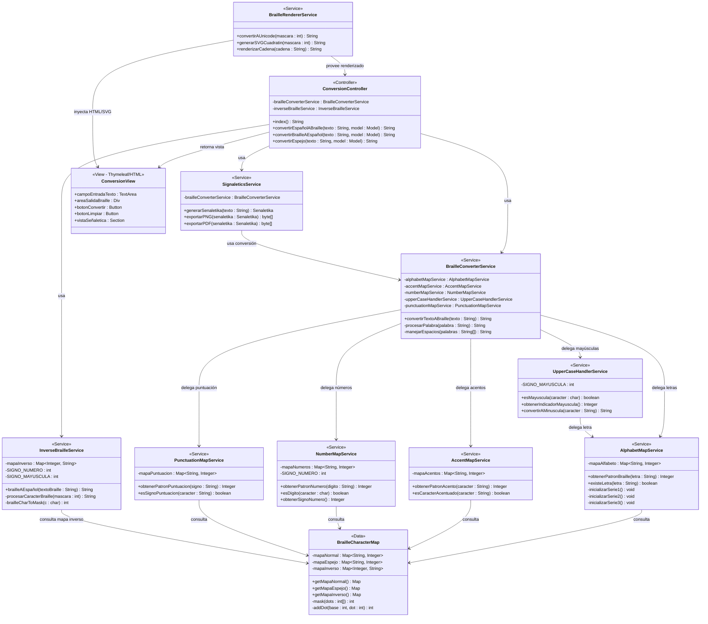
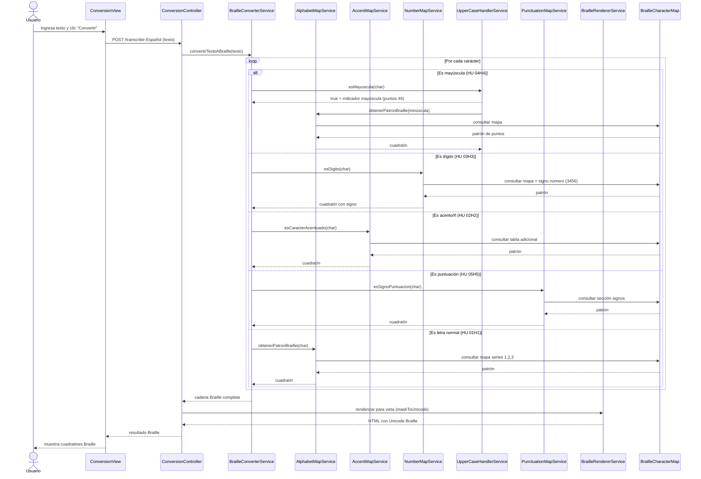
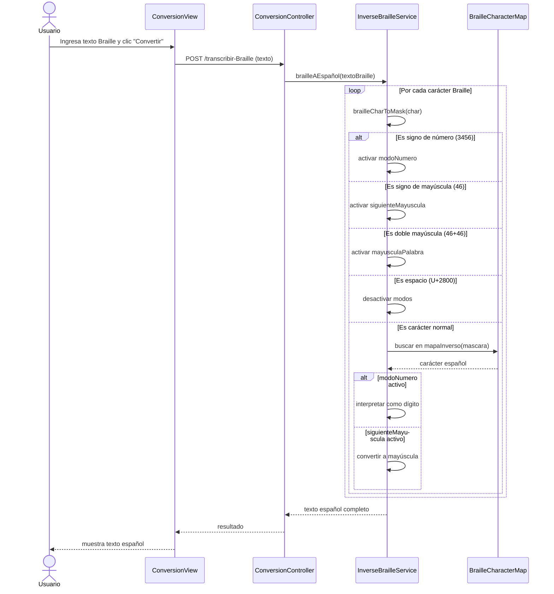

# Diagrama de Clases

## Spanish Braille Application

**Fase XP:** II. Diseño  
**Rol:** Programador — Diseño (Elian Caizapanta)  
**Basado en:** Tarjetas CRC, Historias de Usuario V2 (01H1–07H7) y código existente (ITERACION-2)

---

### Diagrama de Clases General

---

### Mapeo Diseño (CRC) → Implementación Real → HU V2

| Clase CRC (Diseño) | Clase Real (Código ITERACION-2) | HU V2 |
|---------------------|--------------------------------|-------|
| ConversionController | `TranscriptionController.java` | 01H1, 06H6, 07H7 |
| BrailleConverterService | `BrailleMapper.java` → `españolABraille()` | 01H1, 02H2, 03H3, 04H4, 05H5 |
| AlphabetMapService | `BrailleDictionary.java` → `initLetters()` | 01H1 |
| AccentMapService | `BrailleDictionary.java` → `initAccents()` | 02H2 |
| NumberMapService | `BrailleDictionary.java` → `initNumbers()` + `BrailleMapper` (lógica numérica) | 03H3 |
| UpperCaseHandlerService | `BrailleMapper.java` → `SIGNO_MAYUSCULA = mask(4,6)` | 04H4 |
| PunctuationMapService | `BrailleDictionary.java` → `initPunctuation()` | 05H5 |
| BrailleRendererService | `BrailleMapper.java` → `maskToUnicode()` | 01H1 (renderizado) |
| SignaleticsService | *Pendiente — Sprint 2* | 06H6 |
| InverseBrailleService | `BrailleMapper.java` → `brailleAEspañol()` + `EspañolMapper.java` | 07H7 |
| BrailleCharacterMap | `BrailleDictionary.java` → mapas `map`, `pam`, `reverseMap` | 01H1–05H5, 07H7 |
| ConversionView | `index.html`, `result-español.html`, `result-braille.html`, `result-espejo.html` | 01H1, 06H6, 07H7 |

> **Nota:** El diseño CRC propone 12 clases con responsabilidades separadas (SRP). La implementación actual consolida en 3 clases principales (`TranscriptionController`, `BrailleMapper`, `BrailleDictionary`) + `EspañolMapper` + plantillas HTML.

---

### Diagrama de Secuencia — Español → Braille (HU 01H1–05H5)

---

### Diagrama de Secuencia — Braille → Español (HU 07H7)

---

### Patrones de Diseño Identificados

| Patrón | Aplicación en el Diseño |
|--------|------------------------|
| **MVC** (Model-View-Controller) | `ConversionController` (Controller) + `ConversionView` (View) + Services (Model) |
| **Strategy** | Cada `*MapService` implementa una estrategia de conversión para un tipo de carácter |
| **Facade** | `BrailleConverterService` actúa como fachada, ocultando la complejidad de los sub-servicios |
| **Singleton / Data** | `BrailleCharacterMap` como repositorio central de mapeos, consultado por todos los servicios |
| **Template Method** | El flujo de conversión sigue: iterar → clasificar → delegar → ensamblar |
