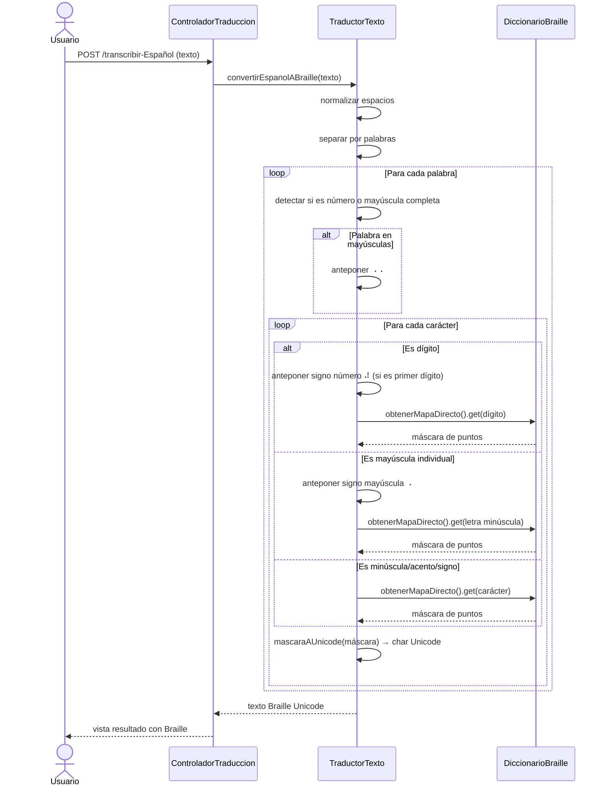
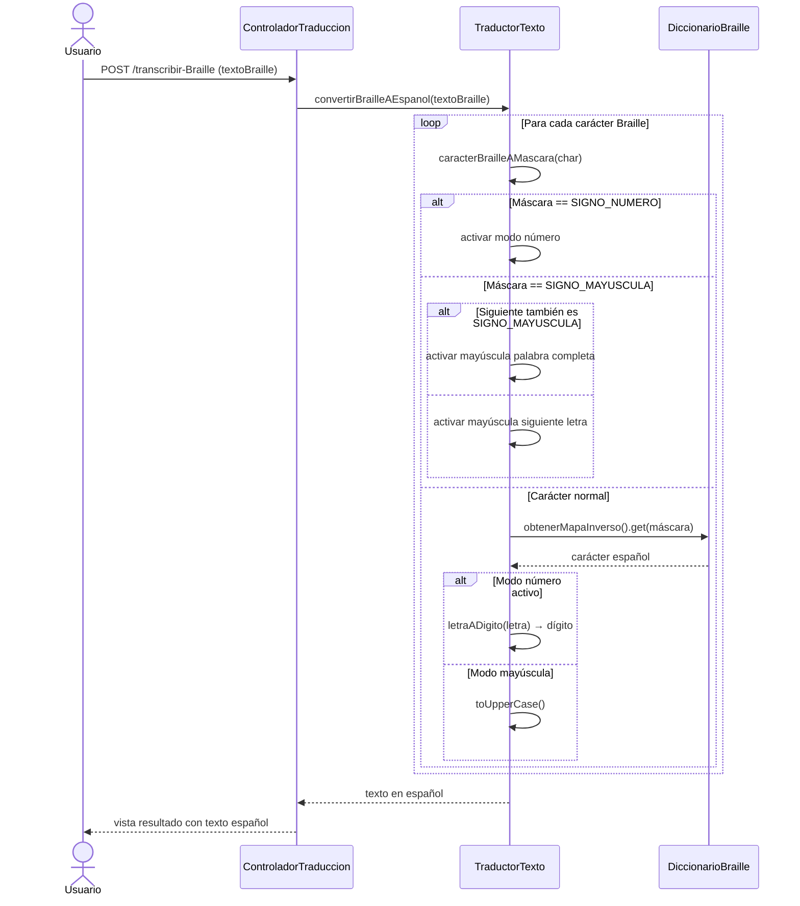

# Diagrama de Clases

## Transcriptor Braille Español

**Proyecto:** Spanish Braille Application  
**Rol:** Diseño (Elian Caizapanta)  
**Iteración:** 2  

---

### Diagrama de Clases (Diseño Prototipo)

> **Nota:** Los nombres de las clases representan el diseño conceptual previo a la implementación. La columna de mapeo al final del documento relaciona cada clase prototipo con su implementación final.

```mermaid
classDiagram
    class AplicacionPrincipal {
        +main(args: String[]) void
    }

    class ControladorTraduccion {
        -traductor: TraductorTexto
        +mostrarPaginaPrincipal() String
        +procesarTextoEspanol(texto: String, modelo: Modelo) String
        +procesarTextoBraille(texto: String, modelo: Modelo) String
        +procesarTextoEspejo(texto: String, modelo: Modelo) String
    }

    class TraductorTexto {
        -SIGNO_NUMERO: int
        -SIGNO_MAYUSCULA: int
        -SIGNO_NUMERO_ESPEJO: int
        -SIGNO_MAYUSCULA_ESPEJO: int
        -diccionario: DiccionarioBraille
        -mapaDirecto: Map~String, Integer~
        -mapaInverso: Map~Integer, String~
        -mapaEspejo: Map~String, Integer~
        +convertirEspanolABraille(texto: String) String
        +convertirBrailleAEspanol(textoBraille: String) String
        +convertirEspanolABrailleEspejo(texto: String) String
        -generarMascara(puntos: int[]) int
        -agregarPunto(base: int, punto: int) int
        -mascaraAUnicode(mascara: int) String
        -esPalabraMayusculaCompleta(palabra: String) boolean
        -caracterBrailleAMascara(braille: char) int
        -letraADigito(letra: String) String
    }

    class DiccionarioBraille {
        -SIGNO_NUMERO: int
        -SIGNO_NUMERO_ESPEJO: int
        -mapaDirecto: Map~String, Integer~
        -mapaInverso: Map~Integer, String~
        -mapaEspejo: Map~String, Integer~
        +DiccionarioBraille()
        +obtenerMapaDirecto() Map~String, Integer~
        +obtenerMapaEspejo() Map~String, Integer~
        +obtenerMapaInverso() Map~Integer, String~
        -inicializarLetras() void
        -inicializarAcentos() void
        -inicializarPuntuacion() void
        -inicializarNumeros() void
        -inicializarMapaInverso() void
        -generarMascara(puntos: int[]) int
        -agregarPunto(base: int, punto: int) int
    }

    class ConvertidorInverso {
        -mapaInverso: Map~Integer, String~
        -SIGNO_NUMERO: int
        -SIGNO_MAYUSCULA: int
        +ConvertidorInverso()
        +convertirBrailleAEspanol(textoBraille: String) String
        -inicializarMapaInverso() void
        -caracterBrailleAMascara(braille: char) int
        -generarMascara(puntos: int[]) int
        -registrar(caracter: String, mascara: int) void
        -letraADigito(letra: String) String
    }

    AplicacionPrincipal ..> ControladorTraduccion : inicia
    ControladorTraduccion --> TraductorTexto : usa
    TraductorTexto --> DiccionarioBraille : consulta
    ConvertidorInverso --|> TraductorTexto : extiende funcionalidad
```

---

### Descripción de Clases

#### AplicacionPrincipal
Punto de entrada de la aplicación Spring Boot. Se encarga de inicializar el contenedor de Spring, cargar los componentes y arrancar el servidor web embebido.

#### ControladorTraduccion
Controlador web que gestiona las solicitudes HTTP del usuario. Recibe texto desde formularios HTML y delega la lógica de conversión al `TraductorTexto`. Expone tres endpoints principales:
- `GET /` — Página principal con formularios de entrada
- `POST /transcribir-Español` — Convierte español a Braille
- `POST /transcribir-Braille` — Convierte Braille a español
- `POST /espejo` — Genera Braille invertido para impresión

#### TraductorTexto
Servicio central de traducción bidireccional. Contiene la lógica para:
- **Español → Braille:** Normaliza espacios, detecta números/mayúsculas, y convierte cada carácter usando el diccionario.
- **Braille → Español:** Interpreta signos de control (número, mayúscula) y busca cada máscara en el mapa inverso.
- **Español → Braille Espejo:** Usa el mapa espejo donde los puntos se reflejan horizontalmente (1↔4, 2↔5, 3↔6) y luego invierte la cadena resultante.

#### DiccionarioBraille
Almacén de datos que mantiene tres mapas de correspondencia:
- **Mapa Directo:** Carácter español → máscara de puntos Braille
- **Mapa Inverso:** Máscara de puntos → carácter español
- **Mapa Espejo:** Carácter español → máscara de puntos Braille reflejados

Inicializa las correspondencias para letras (a-z), vocales acentuadas (á,é,í,ó,ú), caracteres especiales (ñ, ü), signos de puntuación y números (0-9).

#### ConvertidorInverso
Servicio especializado para la conversión Braille → Español. Mantiene su propio mapa inverso con soporte extendido para signos auxiliares adicionales (@, %, ^, &, /, ").

---

### Diagrama de Secuencia: Español → Braille

---

### Diagrama de Secuencia: Braille → Español

---

### Mapeo Diseño Prototipo → Implementación

| Clase Prototipo (Diseño) | Clase Implementada (Código) | Paquete |
|--------------------------|----------------------------|---------|
| AplicacionPrincipal | ProyectoConstruccionApplication | ec.epn.edu.proyectoconstruccion |
| ControladorTraduccion | TranscriptionController | ec.epn.edu.proyectoconstruccion.controller |
| TraductorTexto | BrailleMapper | ec.epn.edu.proyectoconstruccion.service |
| DiccionarioBraille | BrailleDictionary | ec.epn.edu.proyectoconstruccion.service |
| ConvertidorInverso | EspañolMapper | ec.epn.edu.proyectoconstruccion.service |

---

### Patrones de Diseño Identificados

| Patrón | Aplicación |
|--------|------------|
| **MVC (Model-View-Controller)** | Spring Boot separa el controlador (ControladorTraduccion), la lógica de negocio (TraductorTexto/DiccionarioBraille) y las vistas (templates Thymeleaf) |
| **Diccionario / Lookup Table** | DiccionarioBraille centraliza todas las correspondencias carácter↔Braille en mapas HashMap |
| **Strategy** | El controlador delega la conversión al TraductorTexto, que decide la estrategia (directo, inverso o espejo) según el endpoint |
| **Inmutabilidad** | DiccionarioBraille expone mapas de solo lectura (`Collections.unmodifiableMap`) |
