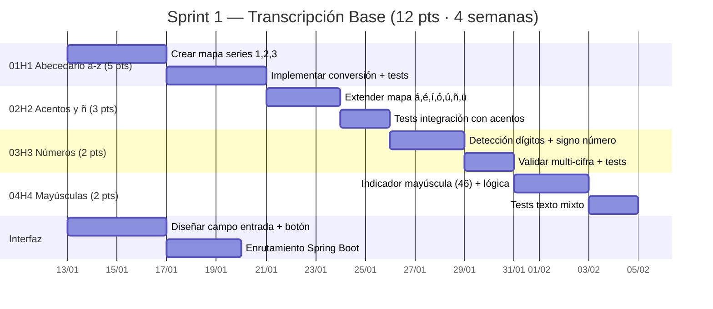
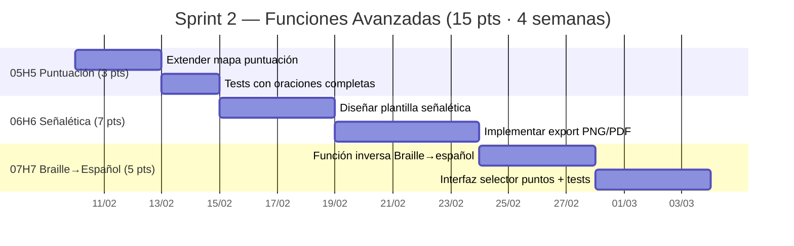

# Roadmap — Alfabeto Braille Español

## Spanish Braille Application

**Fase XP:** II. Diseño  
**Rol:** Programador — Diseño (Elian Caizapanta)  
**Basado en:** Historias de Usuario V2, Velocidad del Proyecto y código existente (ITERACION-2)

---

## 1. Estructura de la Celda Braille

El sistema Braille estándar utiliza una celda de **6 puntos** organizados en 2 columnas × 3 filas:

```
 ┌───┬───┐
 │ 1 │ 4 │
 ├───┼───┤
 │ 2 │ 5 │
 ├───┼───┤
 │ 3 │ 6 │
 └───┴───┘
```

Cada punto puede estar **activo** (relieve) o **inactivo** (liso). La combinación de puntos activos define cada carácter.

**Representación Unicode:** El bloque Braille en Unicode es `U+2800` a `U+28FF`. La máscara de bits se calcula como:  
`U+2800 + (1 << (punto-1))` para cada punto activo.

---

## 2. Alfabeto — Serie 1 (a–j)

Las primeras 10 letras usan solo los puntos 1, 2, 4 y 5:

| Letra | Puntos | Unicode | Representación |
|-------|--------|---------|----------------|
| a | 1 | ⠁ | `⠁` |
| b | 1,2 | ⠃ | `⠃` |
| c | 1,4 | ⠉ | `⠉` |
| d | 1,4,5 | ⠙ | `⠙` |
| e | 1,5 | ⠑ | `⠑` |
| f | 1,2,4 | ⠋ | `⠋` |
| g | 1,2,4,5 | ⠛ | `⠛` |
| h | 1,2,5 | ⠓ | `⠓` |
| i | 2,4 | ⠊ | `⠊` |
| j | 2,4,5 | ⠚ | `⠚` |

---

## 3. Alfabeto — Serie 2 (k–t)

Serie 1 + punto 3 adicional:

| Letra | Puntos | Unicode | Representación |
|-------|--------|---------|----------------|
| k | 1,3 | ⠅ | `⠅` |
| l | 1,2,3 | ⠇ | `⠇` |
| m | 1,3,4 | ⠍ | `⠍` |
| n | 1,3,4,5 | ⠝ | `⠝` |
| o | 1,3,5 | ⠕ | `⠕` |
| p | 1,2,3,4 | ⠏ | `⠏` |
| q | 1,2,3,4,5 | ⠟ | `⠟` |
| r | 1,2,3,5 | ⠗ | `⠗` |
| s | 2,3,4 | ⠎ | `⠎` |
| t | 2,3,4,5 | ⠞ | `⠞` |

---

## 4. Alfabeto — Serie 3 (u–z)

Serie 2 + punto 6 adicional (excepciones):

| Letra | Puntos | Unicode | Representación |
|-------|--------|---------|----------------|
| u | 1,3,6 | ⠥ | `⠥` |
| v | 1,2,3,6 | ⠧ | `⠧` |
| x | 1,3,4,6 | ⠭ | `⠭` |
| y | 1,3,4,5,6 | ⠽ | `⠽` |
| z | 1,3,5,6 | ⠵ | `⠵` |

---

## 5. Letras Adicionales del Español

| Carácter | Puntos | Unicode | Representación |
|----------|--------|---------|----------------|
| ñ | 1,2,4,5,6 | ⠻ | `⠻` |
| ü | 1,2,5,6 | ⠳ | `⠳` |

---

## 6. Vocales Acentuadas

| Carácter | Puntos | Unicode | Representación |
|----------|--------|---------|----------------|
| á | 1,2,3,5,6 | ⠷ | `⠷` |
| é | 2,3,4,6 | ⠮ | `⠮` |
| í | 3,4 | ⠌ | `⠌` |
| ó | 3,4,6 | ⠬ | `⠬` |
| ú | 2,3,4,5,6 | ⠾ | `⠾` |

---

## 7. Números (0–9)

Los números se representan anteponiendo el **signo de número** (puntos 3456 = `⠼`) y usando las letras de la Serie 1:

| Número | Equivalente | Puntos (letra) | Con signo | Ejemplo |
|--------|-------------|-----------------|-----------|---------|
| 1 | a | 1 | ⠼⠁ | `⠼⠁` |
| 2 | b | 1,2 | ⠼⠃ | `⠼⠃` |
| 3 | c | 1,4 | ⠼⠉ | `⠼⠉` |
| 4 | d | 1,4,5 | ⠼⠙ | `⠼⠙` |
| 5 | e | 1,5 | ⠼⠑ | `⠼⠑` |
| 6 | f | 1,2,4 | ⠼⠋ | `⠼⠋` |
| 7 | g | 1,2,4,5 | ⠼⠛ | `⠼⠛` |
| 8 | h | 1,2,5 | ⠼⠓ | `⠼⠓` |
| 9 | i | 2,4 | ⠼⠊ | `⠼⠊` |
| 0 | j | 2,4,5 | ⠼⠚ | `⠼⠚` |

> **Regla:** Para secuencias multi-cifra (ej. "123"), el signo de número se antepone solo una vez: `⠼⠁⠃⠉`

---

## 8. Signos de Puntuación

| Signo | Puntos | Unicode | Representación |
|-------|--------|---------|----------------|
| , (coma) | 2 | ⠂ | `⠂` |
| ; (punto y coma) | 2,3 | ⠆ | `⠆` |
| : (dos puntos) | 2,5 | ⠒ | `⠒` |
| . (punto) | 3 | ⠄ | `⠄` |
| ? (interrogación cierre) | 2,6 | ⠢ | `⠢` |
| ! (exclamación cierre) | 2,3,5 | ⠖ | `⠖` |
| - (guión) | 3,6 | ⠤ | `⠤` |
| ( (paréntesis apertura) | 1,2,6 | ⠣ | `⠣` |
| ) (paréntesis cierre) | 3,4,5 | ⠜ | `⠜` |

---

## 9. Signos de Control

| Signo | Puntos | Unicode | Descripción |
|-------|--------|---------|-------------|
| Signo de número | 3,4,5,6 | ⠼ | Antecede a dígitos para indicar modo numérico |
| Indicador de mayúscula | 4,6 | ⠠ | Antecede a una letra mayúscula |
| Doble mayúscula | 4,6 + 4,6 | ⠠⠠ | Indica palabra completa en mayúsculas |
| Espacio | (ninguno) | ⠀ (U+2800) | Separador de palabras |

---

## 10. Braille Espejo

La aplicación implementa una función de **Braille Espejo** que refleja horizontalmente cada cuadratín:
- Puntos izquierdos (1,2,3) ↔ Puntos derechos (4,5,6)

Esta representación se usa para crear **matrices de impresión**: al imprimir el espejo y dar vuelta al papel, el relieve se lee correctamente.

---

## 11. Ejemplo de Transcripción

**Texto:** `Hola 123`

| Paso | Carácter | Acción | Resultado Braille |
|------|----------|--------|-------------------|
| 1 | H | Mayúscula → indicador (46) + h (125) | ⠠⠓ |
| 2 | o | Letra serie 2 (135) | ⠕ |
| 3 | l | Letra serie 2 (123) | ⠇ |
| 4 | a | Letra serie 1 (1) | ⠁ |
| 5 | (espacio) | Espacio | ⠀ |
| 6 | 1 | Signo número (3456) + a (1) | ⠼⠁ |
| 7 | 2 | b (12) — modo numérico activo | ⠃ |
| 8 | 3 | c (14) — modo numérico activo | ⠉ |

**Resultado:** `⠠⠓⠕⠇⠁⠀⠼⠁⠃⠉`

---

## 12. Planificación de Sprints

### Release Plan

| Sprint | Objetivo | HUs | Story Points | Velocidad |
|--------|----------|-----|-------------|-----------|
| Sprint 1 | Núcleo de transcripción: español → Braille | 01H1 (5), 02H2 (3), 03H3 (2), 04H4 (2) | 12 pts | 3.0 pts/sem |
| Sprint 2 | Puntuación, señalética, bidireccionalidad | 05H5 (3), 06H6 (7), 07H7 (5) | 15 pts | 3.8 pts/sem |
| **Total** | | **7 HU** | **27 pts** | **3.4 pts/sem** |

---

### Sprint 1 — Transcripción base español → Braille



---

### Sprint 2 — Visualización, Señalética y Bidireccionalidad



---

### Velocidad del Proyecto

| Sprint | Story Points | Horas Est. | Hrs Disponibles | Hrs/Punto | Velocidad |
|--------|-------------|------------|-----------------|-----------|-----------|
| Sprint 1 | 12 pts | 24 h | 96 h | 2.0 h/pt | 3.0 pts/sem |
| Sprint 2 | 15 pts | 28 h | 96 h | 1.9 h/pt | 3.8 pts/sem |
| **Promedio** | **27 pts** | **52 h** | **96 h** | **1.9 h/pt** | **3.4 pts/sem** |

> **Capacidad:** 3 personas × 2 h/día × 20 días × 0.80 eficiencia = **96 h netas/sprint**  
> **Velocidad promedio:** Si el equipo mantiene 3.4 pts/sem, puede planificar iteraciones de 12–15 pts de manera sostenible.
