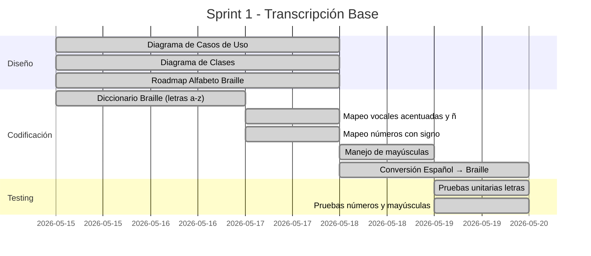
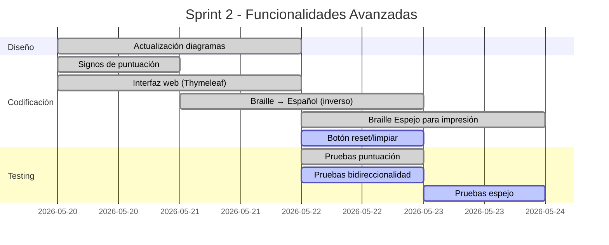

# Roadmap — Alfabeto Braille Español

## Transcriptor Braille Español

**Proyecto:** Spanish Braille Application  
**Rol:** Diseño (Elian Caizapanta)  
**Iteración:** 2  

---

## 1. Celda Braille — Estructura Base

El sistema Braille utiliza una celda de **6 puntos** organizados en dos columnas y tres filas:

```
 ┌───┐
 │1 4│
 │2 5│
 │3 6│
 └───┘
```

Cada carácter se forma activando una combinación específica de estos puntos. En Unicode, el carácter base es `U+2800` (⠀) y cada punto se representa como un bit:

| Punto | Bit | Valor |
|-------|-----|-------|
| 1 | bit 0 | 1 |
| 2 | bit 1 | 2 |
| 3 | bit 2 | 4 |
| 4 | bit 3 | 8 |
| 5 | bit 4 | 16 |
| 6 | bit 5 | 32 |

**Fórmula:** `Carácter Unicode = U+2800 + suma de valores de puntos activos`

---

## 2. Alfabeto Español en Braille

### Primera Serie (Puntos 1, 2, 4, 5)

| Letra | Braille | Puntos | Representación |
|-------|---------|--------|----------------|
| a | ⠁ | 1 | `⠁` |
| b | ⠃ | 1, 2 | `⠃` |
| c | ⠉ | 1, 4 | `⠉` |
| d | ⠙ | 1, 4, 5 | `⠙` |
| e | ⠑ | 1, 5 | `⠑` |
| f | ⠋ | 1, 2, 4 | `⠋` |
| g | ⠛ | 1, 2, 4, 5 | `⠛` |
| h | ⠓ | 1, 2, 5 | `⠓` |
| i | ⠊ | 2, 4 | `⠊` |
| j | ⠚ | 2, 4, 5 | `⠚` |

### Segunda Serie (Primera serie + punto 3)

| Letra | Braille | Puntos | Representación |
|-------|---------|--------|----------------|
| k | ⠅ | 1, 3 | `⠅` |
| l | ⠇ | 1, 2, 3 | `⠇` |
| m | ⠍ | 1, 3, 4 | `⠍` |
| n | ⠝ | 1, 3, 4, 5 | `⠝` |
| o | ⠕ | 1, 3, 5 | `⠕` |
| p | ⠏ | 1, 2, 3, 4 | `⠏` |
| q | ⠟ | 1, 2, 3, 4, 5 | `⠟` |
| r | ⠗ | 1, 2, 3, 5 | `⠗` |
| s | ⠎ | 2, 3, 4 | `⠎` |
| t | ⠞ | 2, 3, 4, 5 | `⠞` |

### Tercera Serie (Segunda serie + punto 6 / combinaciones especiales)

| Letra | Braille | Puntos | Representación |
|-------|---------|--------|----------------|
| u | ⠥ | 1, 3, 6 | `⠥` |
| v | ⠧ | 1, 2, 3, 6 | `⠧` |
| x | ⠭ | 1, 3, 4, 6 | `⠭` |
| y | ⠽ | 1, 3, 4, 5, 6 | `⠽` |
| z | ⠵ | 1, 3, 5, 6 | `⠵` |

### Caracteres Especiales del Español

| Letra | Braille | Puntos | Representación |
|-------|---------|--------|----------------|
| ñ | ⠻ | 1, 2, 4, 5, 6 | `⠻` |
| ü | ⠳ | 1, 2, 5, 6 | `⠳` |

---

## 3. Vocales Acentuadas

| Letra | Braille | Puntos | Representación |
|-------|---------|--------|----------------|
| á | ⠷ | 1, 2, 3, 5, 6 | `⠷` |
| é | ⠮ | 2, 3, 4, 6 | `⠮` |
| í | ⠌ | 3, 4 | `⠌` |
| ó | ⠬ | 3, 4, 6 | `⠬` |
| ú | ⠾ | 2, 3, 4, 5, 6 | `⠾` |

---

## 4. Números

Los números reutilizan los patrones de las letras **a–j**, precedidos por el **signo de número** (puntos 3, 4, 5, 6 = ⠼):

| Número | Braille | Equivalente letra | Puntos |
|--------|---------|-------------------|--------|
| 1 | ⠼⠁ | a (1) | `⠼⠁` |
| 2 | ⠼⠃ | b (1,2) | `⠼⠃` |
| 3 | ⠼⠉ | c (1,4) | `⠼⠉` |
| 4 | ⠼⠙ | d (1,4,5) | `⠼⠙` |
| 5 | ⠼⠑ | e (1,5) | `⠼⠑` |
| 6 | ⠼⠋ | f (1,2,4) | `⠼⠋` |
| 7 | ⠼⠛ | g (1,2,4,5) | `⠼⠛` |
| 8 | ⠼⠓ | h (1,2,5) | `⠼⠓` |
| 9 | ⠼⠊ | i (2,4) | `⠼⠊` |
| 0 | ⠼⠚ | j (2,4,5) | `⠼⠚` |

---

## 5. Signos de Puntuación

| Signo | Braille | Puntos | Representación |
|-------|---------|--------|----------------|
| , (coma) | ⠂ | 2 | `⠂` |
| ; (punto y coma) | ⠆ | 2, 3 | `⠆` |
| : (dos puntos) | ⠒ | 2, 5 | `⠒` |
| . (punto) | ⠄ | 3 | `⠄` |
| ? (interrogación) | ⠢ | 2, 6 | `⠢` |
| ! (exclamación) | ⠖ | 2, 3, 5 | `⠖` |
| - (guión) | ⠤ | 3, 6 | `⠤` |
| ( (paréntesis abre) | ⠣ | 1, 2, 6 | `⠣` |
| ) (paréntesis cierra) | ⠜ | 3, 4, 5 | `⠜` |
| + (más) | ⠖ | 2, 3, 5 | `⠖` |
| * (asterisco) | ⠔ | 3, 5 | `⠔` |
| = (igual) | ⠶ | 2, 3, 5, 6 | `⠶` |

---

## 6. Signos de Control

| Signo | Braille | Puntos | Función |
|-------|---------|--------|---------|
| Signo de número | ⠼ | 3, 4, 5, 6 | Indica que los caracteres siguientes son números |
| Signo de mayúscula | ⠠ | 4, 6 | Indica que la siguiente letra es mayúscula |
| Doble mayúscula | ⠠⠠ | 4,6 + 4,6 | Indica que toda la palabra está en mayúsculas |

---

## 7. Braille Espejo (para impresión en relieve)

Para generar señalética que se pueda percibir al tacto, el Braille se refleja horizontalmente. Los puntos se intercambian:

```
Normal:        Espejo:
 ┌───┐         ┌───┐
 │1 4│   →     │4 1│
 │2 5│   →     │5 2│
 │3 6│   →     │6 3│
 └───┘         └───┘
```

| Intercambio | Normal | Espejo |
|-------------|--------|--------|
| Columna izq ↔ der | Puntos 1,2,3 | Puntos 4,5,6 |

Además, la cadena completa se **invierte** para que al leer desde el reverso del material, el texto quede en el orden correcto.

---

## 8. Roadmap de Desarrollo por Sprint

### Sprint 1 — Funcionalidad Base



### Sprint 2 — Funcionalidad Extendida



---

## 9. Ejemplo de Transcripción Completa

### Ejemplo: "Hola Mundo 123"

```
Texto:   H        o   l   a       M        u   n   d   o       1       2       3
Braille: ⠠⠓      ⠕  ⠇  ⠁  ⠀   ⠠⠍      ⠥  ⠝  ⠙  ⠕  ⠀   ⠼⠁    ⠃      ⠉
         ↑mayúsc.              ↑mayúsc.                   ↑signo núm.
```

### Ejemplo: "café"

```
Texto:   c   a   f   é
Braille: ⠉  ⠁  ⠋  ⠮
```

### Ejemplo: "ECUADOR"

```
Texto:   E   C   U   A   D   O   R
Braille: ⠠⠠⠑  ⠉  ⠥  ⠁  ⠙  ⠕  ⠗
         ↑↑ doble mayúscula (palabra completa)
```
